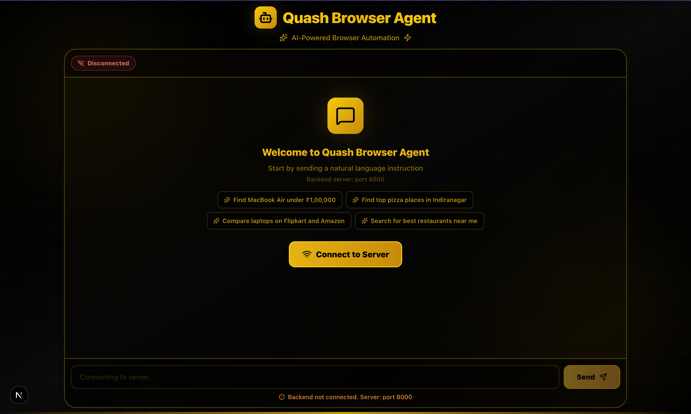
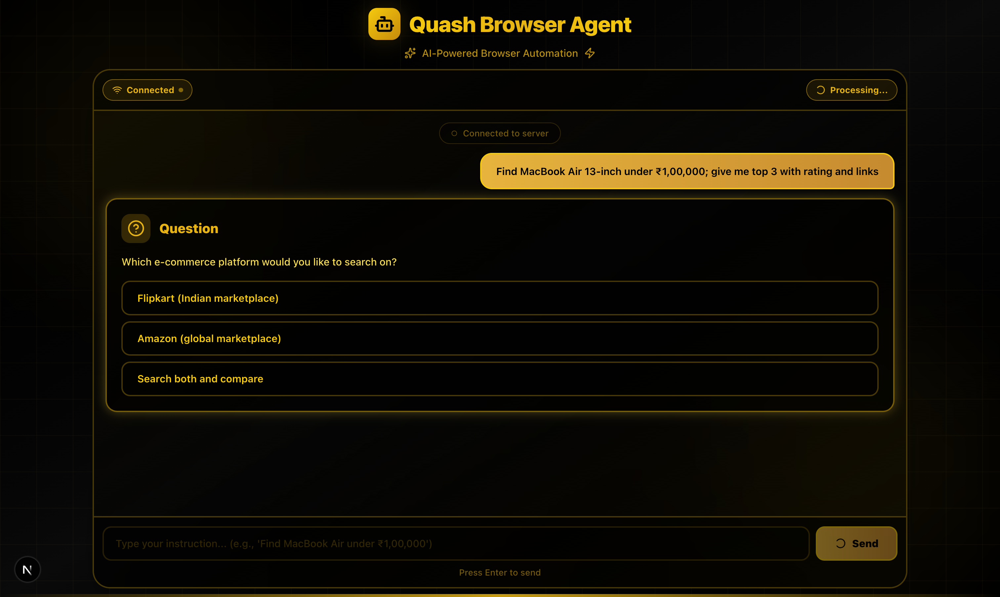
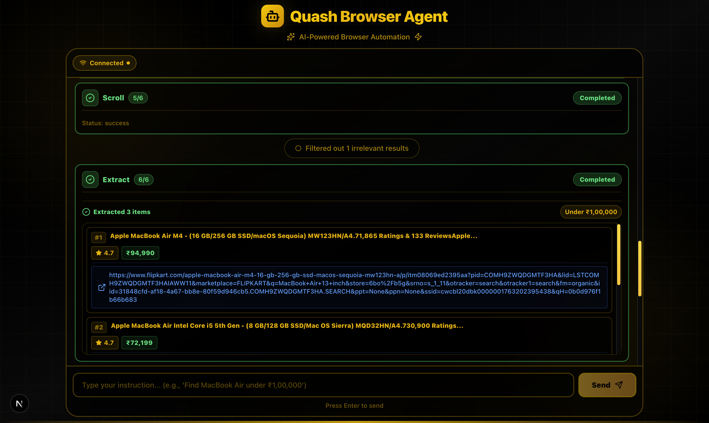
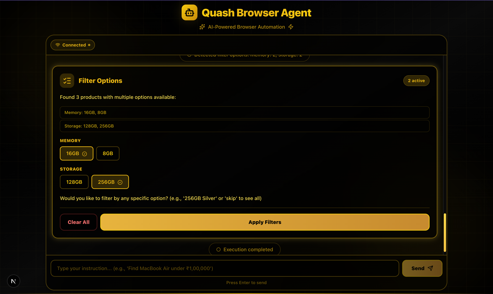
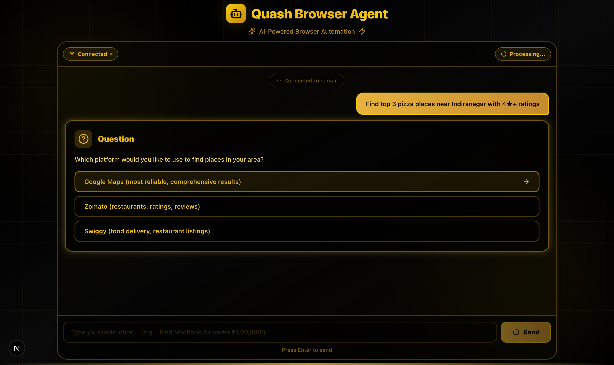
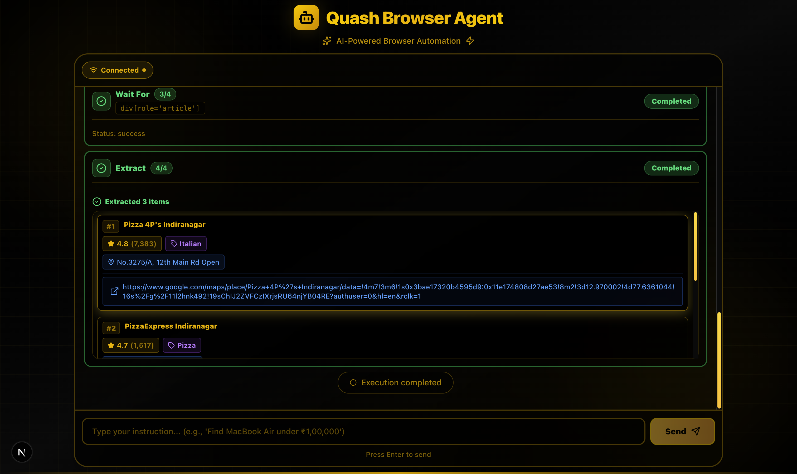
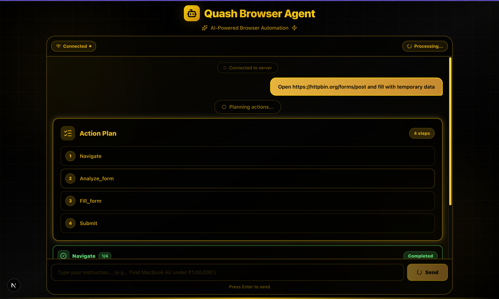
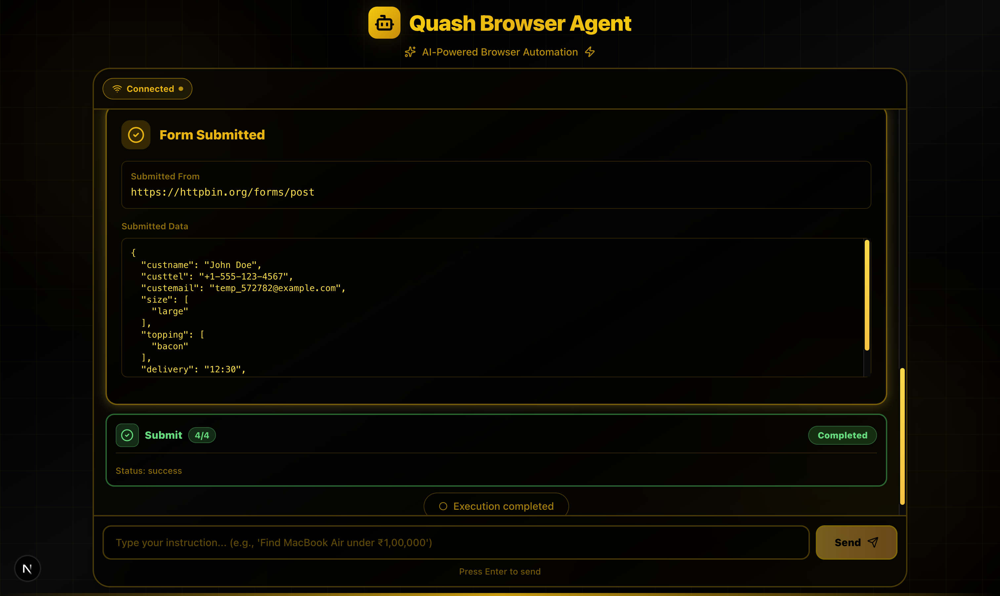

# Quash Browser Control Agent

<div align="center">

**A Production-Ready Conversational Browser Automation System**

*Control real browsers through natural language conversations*

[](https://www.python.org/downloads/)
[](https://fastapi.tiangolo.com/)
[](https://nextjs.org/)
[](https://playwright.dev/)
[](https://www.typescriptlang.org/)
[](LICENSE)

[Features](#key-features) • [Quick Start](#quick-start) • [Screenshots](#screenshots) • [Documentation](#documentation) • [Architecture](#architecture)

</div>

---

## Table of Contents

- [Overview](#overview)
- [Key Features](#key-features)
- [Screenshots](#screenshots)
- [Quick Start](#quick-start)
- [Architecture](#architecture)
- [Usage Examples](#usage-examples)
- [Testing](#testing)
- [Configuration](#configuration)
- [Bonus Features](#bonus-features-implemented)
- [Tech Stack](#tech-stack)
- [Documentation](#documentation)
- [Project Structure](#project-structure)
- [Contributing](#contributing)

---

## Overview

The **Quash Browser Control Agent** is an enterprise-grade conversational browser automation system that interprets natural language instructions and executes them in a real browser. Built with modern technologies and clean architecture principles, it demonstrates production-ready design patterns, robust error handling, and extensible architecture suitable for complex automation workflows.

### What Makes This Special?

- **AI-Powered Planning**: Converts natural language to structured action plans using GPT-4
- **Real Browser Control**: Uses Playwright for reliable, production-grade browser automation
- **Live Streaming**: WebSocket-based real-time action updates and progress tracking
- **Intelligent Extraction**: Extracts structured data from any website automatically
- **Multi-Site Support**: Built-in support for Flipkart, Amazon, Google Maps, Zomato, Swiggy, and more
- **Comparison Engine**: Compare products across multiple e-commerce sites simultaneously
- **Smart Form Filling**: AI-powered form field detection and intelligent value generation
- **Robust Error Handling**: Automatic retries, fallback strategies, and graceful degradation

---

## Key Features

### Core Capabilities

#### 1. **Natural Language Understanding (NLU)**
- Intent classification with hybrid rule-based + LLM approach
- Context extraction (sites, filters, constraints)
- Multi-turn conversation support
- Clarification requests when ambiguous

#### 2. **Real Browser Automation**
- Playwright-based (Chromium, Firefox, WebKit support)
- Multiple wait strategies (networkidle, domcontentloaded, load)
- Element interaction (click, type, select, scroll)
- Stable selector strategies with fallbacks
- Site-specific optimizations

#### 3. **Conversational Chat Interface**
- Real-time WebSocket streaming
- Live action cards with status updates
- Structured progress visualization
- Error messages with helpful suggestions
- No screenshots needed - text-based streaming

#### 4. **AI-Powered Reasoning**
- GPT-4o-mini for planning (configurable)
- Context-aware prompt engineering
- Adaptive execution based on feedback
- Multi-step workflow orchestration

#### 5. **Clean Architecture**
- **Conversation Layer**: Multi-turn context, preferences, clarifications
- **Planning Layer**: Intent → Action plan conversion
- **Execution Layer**: Action orchestration, streaming, filtering
- **Browser Layer**: Low-level browser control, retries, fallbacks
- **AI Layer**: Provider abstraction (OpenAI, Anthropic, Local LLMs)

### Advanced Features

| Feature | Description | Status |
|---------|-------------|--------|
| **Multi-Site Comparison** | Compare products across Flipkart, Amazon, etc. | Implemented |
| **LLM Provider Abstraction** | OpenAI, Anthropic Claude, Ollama (local) | Implemented |
| **Structured Logging** | JSON logging with sensitive data redaction | Implemented |
| **Retry Logic** | Exponential backoff for network/element failures | Implemented |
| **Edge Case Handling** | Stale elements, timeouts, CAPTCHA detection | Implemented |
| **Conversation Memory** | Remember user preferences across sessions | Implemented |
| **Intent Classification** | Automatic task type detection | Implemented |
| **Docker Support** | Fully containerized development environment | Implemented |
| **E2E Tests** | Deterministic tests for critical workflows | Implemented |
| **Site-Specific Strategies** | Optimized selectors for popular sites | Implemented |
| **Filter Handling** | Price, rating, location filters | Implemented |
| **Form Automation** | LLM-powered field detection and filling | Implemented |

---

## Screenshots

### Home Landing Page
<p align="center">
  
  <br/>
  <em>Beautiful landing page with example queries and live connection status</em>
</p>

### Product Search (Flipkart)
<p align="center">
  
  <br/>
  <em>Real-time product search with price filtering</em>
</p>

<p align="center">
  
  <br/>
  <em>Extracted product data with ratings, prices, and links</em>
</p>

<p align="center">
  
  <br/>
  <em>Live action cards showing execution progress</em>
</p>

### Local Discovery (Google Maps/Zomato)
<p align="center">
  
  <br/>
  <em>Finding local places with location and ratings</em>
</p>

<p align="center">
  
  <br/>
  <em>Structured local business data extraction</em>
</p>

### Form Filling
<p align="center">
  
  <br/>
  <em>Intelligent form field detection</em>
</p>

<p align="center">
  
  <br/>
  <em>Automated form submission with success/error tracking</em>
</p>

---

## Quick Start

### Prerequisites

- **Docker & Docker Compose** (Recommended) OR
- **Python 3.9+** and **Node.js 18+**
- **OpenAI API Key** ([Get one here](https://platform.openai.com/account/api-keys))

### Option 1: Docker Setup (Recommended)

```bash
# Clone the repository
git clone <repository-url>
cd quash_assignment

# Set your OpenAI API key
export OPENAI_API_KEY=sk-your-actual-key-here

# Start all services (this will build and run both frontend and backend)
docker-compose up --build

# Access the application
# Frontend: http://localhost:3000
# Backend: http://localhost:8000
```

That's it! The application is now running.

### Option 2: Local Development Setup

#### Backend Setup

```bash
# 1. Navigate to backend directory
cd backend

# 2. Create and activate virtual environment
python3 -m venv venv
source venv/bin/activate  # On Windows: venv\Scripts\activate

# 3. Install dependencies
pip install -r requirements.txt

# 4. Install Playwright browsers
playwright install chromium

# 5. Create .env file
cat > .env << EOL
   OPENAI_API_KEY=sk-your-actual-key-here
   OPENAI_MODEL=gpt-4o-mini
HEADLESS=true
LOG_LEVEL=INFO
EOL

# 6. Run the server
uvicorn app.main:app --reload --port 8000
```

#### Frontend Setup

```bash
# 1. Navigate to frontend directory (in new terminal)
cd frontend

# 2. Install dependencies
npm install

# 3. Run development server
npm run dev

# 4. Open browser
# http://localhost:3000
```

### First Steps

1. **Click "Connect to Server"** button on the landing page
2. **Type a natural language instruction**:
   - `"Find MacBook Air under ₹1,00,000 on Flipkart"`
   - `"Find top 3 pizza places in Indiranagar"`
   - `"Compare laptops on Flipkart and Amazon"`
3. **Watch the magic happen!**

---

## Architecture

### System Architecture Diagram

```
┌─────────────────────────────────────────────────────────────────────┐
│                         Frontend Layer                              │
│  ┌──────────────────────────────────────────────────────────────┐  │
│  │  Next.js 16 + TypeScript + Tailwind CSS                      │  │
│  │  - ChatWindow.tsx: Real-time chat interface                   │  │
│  │  - ActionCard.tsx: Live action status visualization           │  │
│  │  - WebSocket Client: Bidirectional communication              │  │
│  └──────────────────────────────────────────────────────────────┘  │
└────────────────────────────┬────────────────────────────────────────┘
                             │ WebSocket (JSON)
                             │
┌────────────────────────────▼────────────────────────────────────────┐
│                      Backend API Layer                              │
│  ┌──────────────────────────────────────────────────────────────┐  │
│  │  FastAPI + WebSocket                                          │  │
│  │  - /ws: WebSocket endpoint for real-time streaming            │  │
│  │  - /api/plan: Planning endpoint                               │  │
│  │  - ConnectionManager: Session state management                │  │
│  └──────────────────────────────────────────────────────────────┘  │
└────────────────────────────┬────────────────────────────────────────┘
                             │
┌────────────────────────────▼────────────────────────────────────────┐
│                   Execution Orchestrator                            │
│  ┌──────────────────────────────────────────────────────────────┐  │
│  │  executor.py - Main execution loop                            │  │
│  │  ┌──────────┐  ┌──────────┐  ┌──────────┐  ┌──────────┐     │  │
│  │  │  Plan    │→ │  Action  │→ │  Stream  │→ │  Result  │     │  │
│  │  └──────────┘  └──────────┘  └──────────┘  └──────────┘     │  │
│  └──────────────────────────────────────────────────────────────┘  │
└────────────────────────────┬────────────────────────────────────────┘
                             │
            ┌────────────────┼────────────────┐
            │                │                │
┌───────────▼──────┐ ┌───────▼──────┐ ┌──────▼───────┐
│  Conversation    │ │   Planner    │ │   Browser    │
│    Manager       │ │    (AI)      │ │    Agent     │
│                  │ │              │ │              │
│ - Context        │ │ - Intent     │ │ - Playwright │
│ - Preferences    │ │ - Strategies │ │ - Selectors  │
│ - Clarifications │ │ - Actions    │ │ - Extraction │
└──────────────────┘ └──────────────┘ └──────────────┘
```

### Layer Responsibilities

| Layer | Purpose | Key Components |
|-------|---------|----------------|
| **Frontend** | User interface and real-time updates | `ChatWindow.tsx`, `ActionCard.tsx` |
| **API** | WebSocket management and routing | `main.py`, `websocket.py` |
| **Conversation** | Multi-turn context and preferences | `conversation.py` |
| **Planning** | Natural language → Action plans | `ai_planner.py`, `intent_classifier.py` |
| **Execution** | Action orchestration and streaming | `executor.py`, `comparison_handler.py` |
| **Browser** | Low-level browser control | `browser_agent.py` |
| **AI** | LLM provider abstraction | `llm_provider.py` |

### Design Patterns Used

- **Factory Pattern**: LLM provider creation
- **Strategy Pattern**: Site-specific selector strategies
- **Observer Pattern**: WebSocket event streaming
- **Retry Pattern**: Exponential backoff for failures
- **Circuit Breaker**: Prevent cascading failures
- **Provider Pattern**: Abstract LLM providers

---

## Usage Examples

### 1. Product Search & Filtering

**Simple Search:**
```
"Find MacBook Air on Flipkart"
```

**With Price Filter:**
```
"Find MacBook Air under ₹1,00,000 on Flipkart"
"Search for wireless headphones below ₹5,000"
"Show me laptops between ₹40,000 and ₹60,000"
```

**With Rating Filter:**
```
"Find 4+ star rated phones on Amazon"
"Show me highly rated laptops with at least 4.5 stars"
```

### 2. Multi-Site Comparison

```
"Compare MacBook Air prices on Flipkart and Amazon"
"Find laptops under ₹60,000 on Flipkart and Amazon"
"Compare wireless headphones on multiple sites"
```

The system will:
1. Search on each site
2. Extract products with prices and ratings
3. Present side-by-side comparison
4. Highlight best deals

### 3. Local Discovery

**Restaurant Search:**
```
"Find top 3 pizza places in Indiranagar"
"Show best restaurants near HSR Layout with 4+ ratings"
"Find Italian restaurants in Koramangala with delivery"
```

**Service Search:**
```
"Find 24/7 open medical shops in Thane"
"Show me gyms near Whitefield"
"Find coffee shops in MG Road area"
```

### 4. Form Filling

```
"Fill out the signup form on example.com/register"
"Register with a temporary email on this page"
"Open https://example.com/contact and fill the form"
```

The system will:
1. Analyze form fields
2. Generate appropriate values
3. Fill and submit
4. Report success/errors

### 5. URL Search (YouTube, etc.)

```
"Search for Python tutorial on YouTube and give me the URL"
"Find a video about React on YouTube and show the link"
"Search Google for Python documentation and give first result"
```

### 6. General Browsing

```
"Navigate to example.com and extract the page title"
"Go to python.org and get the latest release version"
"Visit github.com and tell me what's trending"
```

---

## Testing

### Run All Tests

```bash
cd backend
pytest tests/ -v
```

### Run Specific Test Suite

```bash
# Navigation tests
pytest tests/test_navigation.py -v

# Run specific test
pytest tests/test_navigation.py::test_navigate_to_valid_url -v

# Run with coverage
pytest tests/ --cov=app --cov-report=html
```

### Test Coverage

Current test coverage includes:

**Navigation Tests**
- Valid URL navigation
- Invalid URL handling
- URL without protocol
- Browser restart functionality

**Element Tests**
- Wait for element (success)
- Wait for element (timeout)
- Stale element recovery

**Extraction Tests**
- Basic content extraction
- Structured data extraction
- Empty result handling

**Site Detection Tests**
- Flipkart, Amazon, Google Maps
- Generic site handling

### Manual Testing Checklist

- [ ] Product search on Flipkart
- [ ] Product search on Amazon
- [ ] Multi-site comparison
- [ ] Local place search on Google Maps
- [ ] Local place search on Zomato
- [ ] Form filling
- [ ] Price filtering
- [ ] Rating filtering
- [ ] Error handling (invalid URL)
- [ ] Error handling (element not found)

---

## Configuration

### Environment Variables

#### Backend (`backend/.env`)

```bash
# Required
OPENAI_API_KEY=sk-your-key-here

# LLM Configuration
OPENAI_MODEL=gpt-4o-mini              # gpt-4o, gpt-4o-mini, gpt-3.5-turbo
LLM_PROVIDER=openai                    # openai, anthropic, local

# Alternative Providers
ANTHROPIC_API_KEY=your-anthropic-key   # For Claude
ANTHROPIC_MODEL=claude-3-sonnet-20240229
LOCAL_LLM_URL=http://localhost:11434  # For Ollama
LOCAL_LLM_MODEL=llama2

# Browser Configuration
HEADLESS=true                          # false to see browser
BROWSER_TIMEOUT=30000                  # Navigation timeout (ms)
VIEWPORT_WIDTH=1920
VIEWPORT_HEIGHT=1080

# Logging
LOG_LEVEL=INFO                         # DEBUG, INFO, WARNING, ERROR
LOG_FILE=logs/app.log
ENABLE_REDACTION=true                  # Redact sensitive data

# Server
HOST=0.0.0.0
PORT=8000
```

#### Frontend (`frontend/.env.local`)

```bash
NEXT_PUBLIC_WS_URL=ws://localhost:8000/ws
NEXT_PUBLIC_API_URL=http://localhost:8000
```

### Advanced Configuration

#### Using Claude (Anthropic)

```bash
# In backend/.env
LLM_PROVIDER=anthropic
ANTHROPIC_API_KEY=sk-ant-your-key-here
ANTHROPIC_MODEL=claude-3-sonnet-20240229
```

Benefits:
- Better reasoning for complex queries
- More natural conversation
- Better context understanding

#### Using Local LLM (Ollama)

```bash
# 1. Install Ollama
curl -fsSL https://ollama.com/install.sh | sh

# 2. Pull a model
ollama pull llama2

# 3. Configure backend/.env
LLM_PROVIDER=local
LOCAL_LLM_URL=http://localhost:11434
LOCAL_LLM_MODEL=llama2
```

Benefits:
- No API costs
- Complete privacy
- Works offline

---

## Bonus Features Implemented

All bonus features from the assignment are fully implemented:

| Feature | Description | Status |
|---------|-------------|--------|
| **WebSocket Streaming** | Granular action events with real-time updates | **IMPLEMENTED** |
| **User Preference Memory** | Remembers preferences across tasks | **IMPLEMENTED** |
| **Multi-Site Comparison** | Compare products across Flipkart, Amazon, etc. | **IMPLEMENTED** |
| **LLM Provider Abstraction** | OpenAI, Anthropic, Local (Ollama) support | **IMPLEMENTED** |
| **Dockerized Dev Stack** | Complete Docker Compose setup | **IMPLEMENTED** |
| **E2E Tests** | Deterministic tests for navigation workflow | **IMPLEMENTED** |

### Additional Bonus Features

| Feature | Description | Status |
|---------|-------------|--------|
| **Structured Logging** | JSON logs with sensitive data redaction | **IMPLEMENTED** |
| **Retry Logic** | Exponential backoff for failures | **IMPLEMENTED** |
| **Edge Case Handling** | CAPTCHA detection, stale elements, timeouts | **IMPLEMENTED** |
| **Intent Classification** | Automatic task type detection | **IMPLEMENTED** |
| **Site-Specific Strategies** | Optimized selectors for popular sites | **IMPLEMENTED** |
| **Filter Handling** | Price, rating, location filters | **IMPLEMENTED** |
| **Form Automation** | Intelligent form field detection | **IMPLEMENTED** |
| **Clarification System** | Smart clarification requests | **IMPLEMENTED** |

---

## Tech Stack

### Backend

| Component | Technology | Purpose |
|-----------|-----------|---------|
| **Framework** | FastAPI | Async API with WebSocket support |
| **Browser Automation** | Playwright | Production-grade browser control |
| **AI/LLM** | OpenAI GPT-4o-mini | Natural language understanding and planning |
| **Communication** | WebSockets | Real-time bidirectional streaming |
| **Testing** | Pytest | Async test framework |
| **Logging** | Python logging | Structured JSON logging with redaction |

### Frontend

| Component | Technology | Purpose |
|-----------|-----------|---------|
| **Framework** | Next.js 16 | React framework with App Router |
| **Language** | TypeScript | Type-safe development |
| **Styling** | Tailwind CSS | Utility-first CSS framework |
| **Icons** | Lucide React | Beautiful, consistent icons |
| **Communication** | WebSocket API | Real-time updates from backend |

### DevOps

| Component | Technology | Purpose |
|-----------|-----------|---------|
| **Containerization** | Docker | Isolated development environment |
| **Orchestration** | Docker Compose | Multi-container management |
| **CI/CD** | GitHub Actions (ready) | Automated testing and deployment |

---

## Documentation

### Available Documentation

1. **[Technical Write-Up](TECHNICAL_WRITEUP.md)** (Required Deliverable)
   - Complete architecture overview
   - Design decisions and trade-offs
   - Failure handling strategies
   - Performance characteristics
   - Security considerations
   - Next steps and enhancements


3. **[API Documentation](http://localhost:8000/docs)** (When Running)
   - FastAPI auto-generated docs
   - WebSocket protocol
   - Request/response schemas

4. **[Code Documentation](backend/app/)**
   - Inline docstrings
   - Type hints
   - Module-level documentation

### Key Architecture Documents

**Conversation Flow:**
```
User Input → Intent Classification → Planning → Execution → Streaming → Result
     ↓              ↓                    ↓            ↓            ↓
  History    Context Extraction    Action Plan   Browser     WebSocket
     ↓              ↓                    ↓          Control      ↓
Preferences   Clarifications      Site Strategy   Extraction   UI Update
```

**Error Handling:**
```
Error Detected → Classify Error Type → Apply Strategy → Retry or Fallback
     ↓                   ↓                    ↓              ↓
  Network          Stale Element         Exponential     Alternative
  Timeout          Not Found              Backoff         Selector
     ↓                   ↓                    ↓              ↓
  Retry 3x         Re-query Element      Wait & Retry    Try Next
```

---

## Project Structure

```
quash_assignment/
├── backend/                          # Backend FastAPI application
│   ├── app/
│   │   ├── api/                      # API routes
│   │   │   ├── plan.py              # Planning endpoint
│   │   │   └── websocket.py          # WebSocket handler
│   │   ├── core/                     # Core configurations
│   │   │   ├── config.py            # Settings and environment
│   │   │   ├── llm_provider.py      # LLM abstraction layer
│   │   │   ├── logger.py            # Structured logging
│   │   │   └── retry.py             # Retry logic
│   │   ├── services/                 # Business logic
│   │   │   ├── browser_agent.py     # Browser automation
│   │   │   ├── ai_planner.py        # Action planning
│   │   │   ├── executor.py          # Action execution
│   │   │   ├── conversation.py      # Conversation management
│   │   │   ├── intent_classifier.py # Intent detection
│   │   │   ├── comparison_handler.py# Multi-site comparison
│   │   │   ├── filter_results.py    # Result filtering
│   │   │   ├── edge_case_handlers.py# Error handling
│   │   │   ├── site_handlers.py     # Site-specific logic
│   │   │   └── site_selectors.py    # CSS selectors
│   │   └── main.py                  # FastAPI app entry
│   ├── tests/                        # Test suite
│   │   ├── conftest.py              # Pytest configuration
│   │   └── test_navigation.py       # Navigation tests
│   ├── logs/                         # Application logs
│   │   └── app.log
│   ├── requirements.txt              # Python dependencies
│   ├── pytest.ini                    # Pytest config
│   └── .env.example                  # Environment template
├── frontend/                         # Next.js frontend
│   ├── app/
│   │   ├── components/
│   │   │   ├── ChatWindow.tsx       # Main chat interface
│   │   │   └── ActionCard.tsx       # Action status cards
│   │   ├── globals.css              # Global styles
│   │   ├── layout.tsx               # Root layout
│   │   └── page.tsx                 # Home page
│   ├── public/                       # Static assets
│   │   ├── home.png                 # Landing page screenshot
│   │   ├── prod1.png, prod2.png, prod3.png  # Product search
│   │   ├── local1.png, local2.png   # Local discovery
│   │   └── form1.png, form2.png     # Form filling
│   ├── package.json                  # Node dependencies
│   ├── tsconfig.json                 # TypeScript config
│   └── next.config.ts                # Next.js config
├── docs/                             # Additional documentation
│   └── Quash AI Assignment.txt       # Original assignment
├── docker-compose.yml                # Docker orchestration
├── Dockerfile.backend                # Backend container
├── Dockerfile.frontend               # Frontend container
├── README.md                         # This file
├── TECHNICAL_WRITEUP.md             # Technical documentation
└── STRUCTURE.md                      # Project structure
```

---

## Meeting Assignment Requirements

### Core Technical Requirements

| Requirement | Implementation | Status |
|------------|----------------|--------|
| **1. Natural Language Understanding** | Intent classification + LLM planning |  **Implemented** |
| **2. Browser Automation Engine** | Playwright with robust waits and fallbacks |  **Implemented** |
| **3. Conversational Interface** | WebSocket-based chat with action cards |  **Implemented** |
| **4. AI-Powered Reasoning** | GPT-4o-mini with modular prompts |  **Implemented** |
| **5. Robust Architecture** | 5-layer clean architecture |  **Implemented** |

### Example User Journeys

| Journey | Example | Status |
|---------|---------|--------|
| **A. Product Search** | "Find MacBook Air under ₹1,00,000" | **IMPLEMENTED** |
| **B. Form Fill** | "Fill signup form on example.com" | **IMPLEMENTED** |
| **C. Local Discovery** | "Top pizza places in Indiranagar" | **IMPLEMENTED** |

### Deliverables

| Item | Location | Status |
|------|----------|--------|
| **1. Codebase** | This repository |  **COMPLETE** |
| **2. README** | This file |  **COMPLETE** |
| **3. Technical Write-Up** | [TECHNICAL_WRITEUP.md](TECHNICAL_WRITEUP.md) |  **COMPLETE** |
| **4. Reasoning/Plan Logs** | [REASONING_AND_FUTURE_PROSPECTS.md](REASONING_AND_FUTURE_PROSPECTS.md) |  **COMPLETE** |
| **5. Demo Video** | (To be recorded) | **PENDING** |

---

## Error Handling & Resilience

### Implemented Strategies

1. **Network Failures**
   - Exponential backoff (1s, 2s, 4s)
   - Circuit breaker pattern
   - Alternative site suggestions

2. **Element Not Found**
   - Multiple selector fallbacks
   - User-friendly error messages
   - Suggested alternatives

3. **Stale Elements**
   - Automatic re-query
   - Progressive backoff
   - Max 3 retry attempts

4. **CAPTCHA/Blocking**
   - Content analysis detection
   - Alternative site suggestions
   - Clear user notifications

5. **LLM API Failures**
   - Clear error messages
   - API key validation
   - Graceful degradation

6. **Form Validation**
   - Field analysis
   - Retry with different values
   - Error extraction

---

## Security Features

- **Sensitive Data Redaction**: API keys, passwords, emails automatically redacted in logs
- **Input Validation**: WebSocket input validation
- **Sandboxed Browser**: Isolated browser contexts
- **Environment Variables**: Secure configuration management
- **No Persistent Storage**: No cookies or data persistence

---

## Unique Features

1. **Hybrid Intent Classification**: Rule-based + LLM for speed and accuracy
2. **Site-Specific Optimizations**: Tailored selectors for popular sites
3. **Progressive Fallbacks**: Multiple selector strategies per element
4. **Structured Streaming**: Granular action events, not just logs
5. **Beautiful UI**: Modern design with real-time animations
6. **Zero-Config Docker**: One command deployment
7. **Multi-Provider LLM**: Switch between OpenAI, Claude, or local models
8. **Conversation Context**: Multi-turn conversations with memory

---

## Future Enhancements

### Short-term (1-2 months)
- [ ] Enhanced error messages with more context
- [ ] Performance optimization (parallel execution)
- [ ] Increase test coverage to 80%+
- [ ] Add monitoring dashboard

### Medium-term (3-6 months)
- [ ] Multi-step workflows with branching
- [ ] User-defined action sequences
- [ ] Redis session store for horizontal scaling
- [ ] Prometheus metrics

### Long-term (6+ months)
- [ ] Fine-tuned models for planning
- [ ] Screenshot-based element detection
- [ ] Voice command support
- [ ] Mobile browser automation

---

## Contributing

Contributions are welcome! Please follow these guidelines:

1. Fork the repository
2. Create a feature branch (`git checkout -b feature/AmazingFeature`)
3. Commit your changes (`git commit -m 'Add some AmazingFeature'`)
4. Push to the branch (`git push origin feature/AmazingFeature`)
5. Open a Pull Request

### Development Guidelines

- Follow PEP 8 for Python code
- Use TypeScript for all frontend code
- Add tests for new features
- Update documentation
- Keep commits atomic and well-described

---

## License

This project is created as part of the Quash AI Assignment.

**Made by Yash Tiwari**

---

## Acknowledgments

- **Quash AI** for the interesting assignment
- **OpenAI** for GPT-4 API
- **Playwright** team for excellent browser automation
- **FastAPI** and **Next.js** communities

---

## Support

For issues or questions:

1. Check the [Technical Write-Up](TECHNICAL_WRITEUP.md)
2. Review [closed issues](../../issues?q=is%3Aissue+is%3Aclosed)
3. Open a [new issue](../../issues/new)

---

## Learning Resources

- [FastAPI Documentation](https://fastapi.tiangolo.com/)
- [Playwright Documentation](https://playwright.dev/)
- [Next.js Documentation](https://nextjs.org/docs)
- [OpenAI API Documentation](https://platform.openai.com/docs)

---

<div align="center">

**Star this repository if you find it helpful!**

Built with modern technologies and best practices for production-ready browser automation.

</div>
